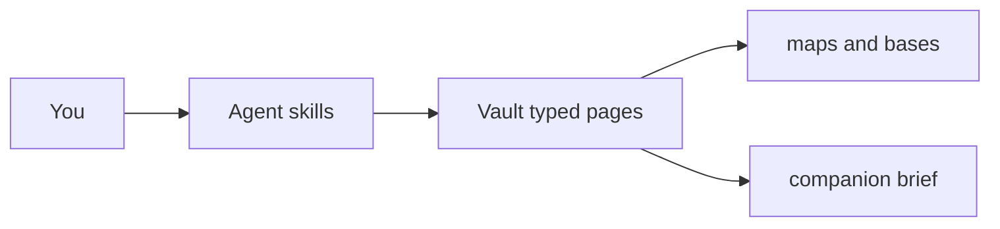

# Columbus: ramp-up map and companion

Columbus is how you ramp up a new company on one second-brain vault. Typed wiki pages are the source of truth. Maps, Bases tables, and the companion brief are generated from those pages.

## What you got

- **second-brain** — durable wiki, ingest, lint, compile, and `brief me`.
- **columbus** — survey / chart / trace / ask / render against that wiki.
- **Vault** — `~/.second_brain_vault`. Maps live in `maps/`. People and open loops live in `bases/`.

Facts live in `wiki/<Name>.md` with a `type` property. Maps and the brief never become the source of truth.

| Type | For |
|------|-----|
| `domain` / `service` / `component` / `datastore` / `external` / `flow` | map places |
| `repo` | how to build, test, run, and what it implements |
| `person` / `question` / `commitment` | people and open loops |
| `concept` | glossary |

Knowledge on places (and `repo` / `concept`) is `rumored` → `seen` → `understood` → `owned`. Promotion needs `sources`; `owned` needs a `pr:` source.

## First-day setup (new computer)

1. On the current machine, **commit and push** the dotfiles changes (columbus skill, second-brain updates, `home.nix`) **before** setting up the new computer. The new machine clones the repo; flake evaluation only sees git-tracked files. (On the current machine, `git add` is enough for a local rebuild.) Tracked skill dirs are what `home.nix` links into `~/.cursor/skills` and the other agent homes.
2. On the new machine, clone the repo and run `./rebuild.sh` (flake rebuild + activation). The first rebuild also merges the brief hook into `~/.cursor/hooks.json` without touching other hooks.
3. Open `~/.second_brain_vault` in Obsidian.
4. Confirm the hook in **Cursor Settings → Hooks**: `sessionStart` should run `brief.py --hook`.

Activation copies `vault-seed/` only if the vault does not already exist. It may delete `maps/.gitkeep` after the copy; that is expected.

## Talking to it

Say what you want; the agent should announce `Using skill: columbus` or `Using skill: second-brain`.

| You say | Mode |
|---------|------|
| "Survey this repo" / "Ramp me up on payments-api" | survey |
| "Chart these meeting notes" / "I learned that Ada owns Ledger" | chart |
| "Trace checkout authorize end to end" | trace |
| "What do I know about Fraud?" / "How do I test Ledger?" | ask |
| "Render the map" / "Check typed pages" | render |
| "Brief me" / "What's open?" | second-brain `brief` |
| "What did we file about Ada?" | second-brain query |

Example prompts:

- Survey: "Ramp me up on this repo. Find how to build, test, and run it, which services it implements, and who to ask about the rest."
- Chart: "Here are standup notes. File people, open questions, and anything that is still rumored."
- Trace: "Trace an authorize request from the HTTP entrypoint to the ledger write. File a flow."
- Ask: "How do I run the payments tests locally? Answer from the vault first."
- Render: "Regenerate canvases and tell me explored % before and after."

Survey stays bounded: breadth first, and the agent should say what it skipped.

## Reading the map

Zoom levels (open the matching canvas):

1. **World** — `maps/world.canvas`: domains, externals, cross-domain edges, explored %.
2. **Domain** — `maps/domain-<slug>.canvas`: services, datastores, externals in that domain.
3. **Service** — `maps/service-<slug>.canvas`: components plus neighbors.
4. **Flow** — `maps/flow-<slug>.canvas`: one request, left to right, numbered steps.

Color legend (knowledge on places):

| Color | Meaning |
|-------|---------|
| Gray | rumored (heard, not verified) |
| Cyan | seen (you have looked at it) |
| Green | understood (trace or docs prove it) |
| Yellow | owned (you changed it; needs a `pr:` source) |
| Purple | person (preset 6; no knowledge state) |
| `? Name` | fog — linked, no page yet |
| Gray `kind?` edge | unverified / `maybe` |

Dragging nodes is preserved on re-render. Only positions are hand-edits; do not treat the canvas as the source of truth.

## People and open loops

- **People.base** — people, team, role, owns, ask-about.
- **Open loops.base** — open questions and open commitments (two table views).
- **Graph view** — seeded color groups by `type` (domain, service, person, concept, question).
- **people.canvas** — who owns what and who to ask.

## The companion brief

On your first agent chat of the day, the agent opens with a short brief (at most 8 lines), then answers your message. It won't repeat it later in that chat. At most once per day.

Typical contents:

- explored %
- open questions (who to ask, about what)
- open commitments (to whom, due, overdue if past)
- pages updated since the last brief (or last 7 days on the first run)
- a few `concept` glossary terms to review (rotates via state)

Ask **"brief me"** anytime. That prints the markdown brief and updates `<vault>/.companion/state.json`.

The hook fails open (`{}`) if the vault is missing, has no typed pages, already briefed today, or the process errors. Background agents also get `{}`.

## Suggested first-week routine

- **Day 1:** survey the main repo. Open `maps/world.canvas` and skim fog.
- **After each meeting:** chart notes (people, questions, commitments, rumored edges).
- **Each day:** trace one real request into a `flow` page.
- **End of day:** "brief me", close or raise questions, glance at Open loops.

Do not copy source code or secrets into the vault. Paths, names, and short explanations only.

## Where files live

| What | Where |
|------|--------|
| Skills | `ai_agents_tools/skills/columbus`, `ai_agents_tools/skills/second-brain` (linked under `~/.cursor/skills/`) |
| Render script | `columbus/scripts/render_maps.py` (`--vault`, `--check`) |
| Brief script | `second-brain/scripts/brief.py` (`--vault`, `--hook`) |
| Typed-page contract | `second-brain/references/typed-pages.md` |
| Vault seed | `second-brain/vault-seed/` (`schema/`, `index.md`, `maps/`, `bases/`, `.obsidian/graph.json`) |
| Live vault | `~/.second_brain_vault` |
| Wiki pages | `wiki/<Name>.md` |
| Maps / bases | `maps/*.canvas`, `bases/*.base` |
| Brief state | `.companion/state.json` |
| This guide | `docs/columbus-guide.md` |

## Troubleshooting

**No brief at session start**

- Check **Cursor Settings → Hooks** for `brief.py --hook`.
- Confirm the vault has typed pages (`type:` in frontmatter).
- Already briefed today → delete or edit `.companion/state.json` (`last_brief`).

**Maps empty**

- Run `python3 ~/.cursor/skills/columbus/scripts/render_maps.py` (optional `--vault PATH`).
- Run the same command with `--check` (exit 1 lists findings: missing `type`, bad knowledge, missing `sources`).
- World canvas still exists with a legend even on a thin vault; domain/service/flow canvases appear once those typed pages exist.

**Skill not found**

- `git add` the new skill dirs, then `./rebuild.sh`. Untracked skill folders are not installed.

**Upgrade an old vault (do not overwrite)**

- Create missing `maps/` and `bases/` (copy seed bases only if absent).
- Append the typed-pages pointer to `schema/AGENTS.md` if missing.
- Add a `## Maps` section to `index.md` if missing.
